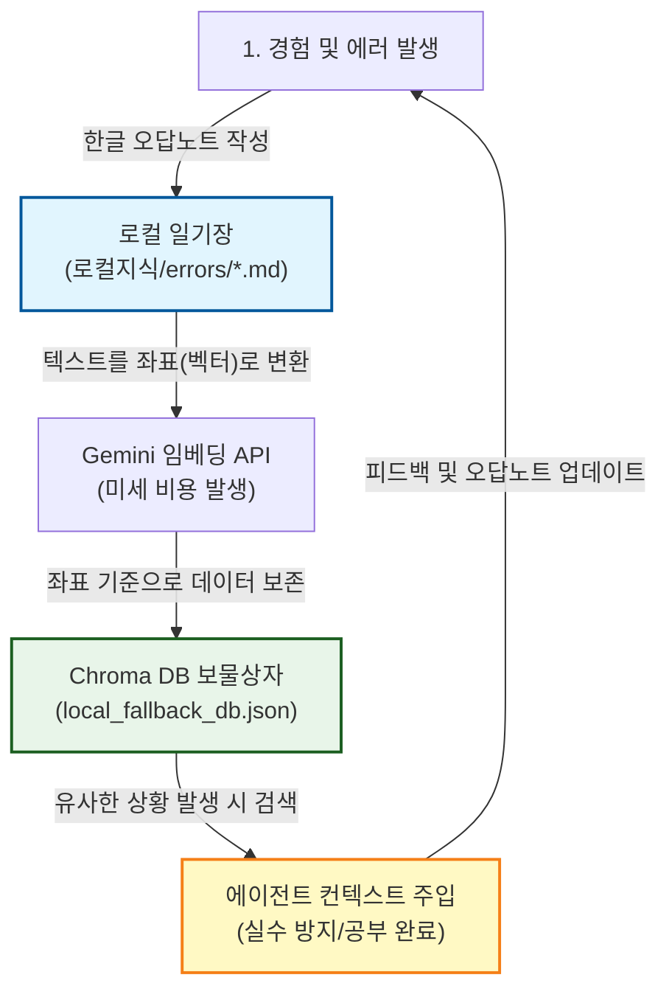
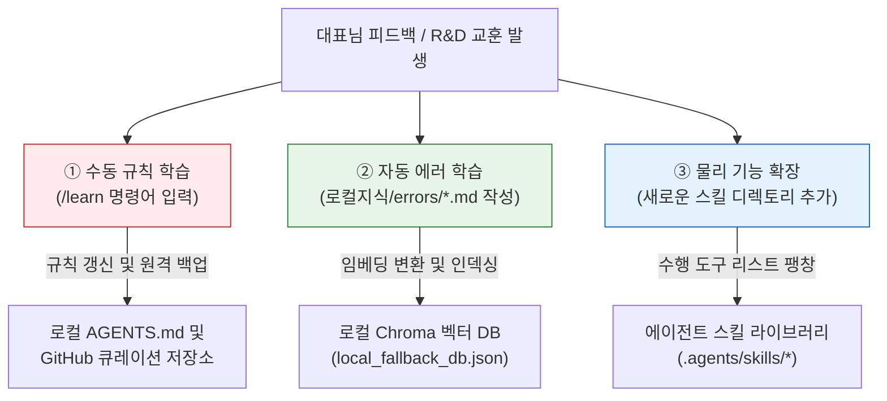
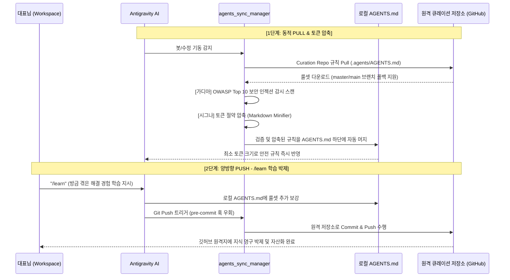
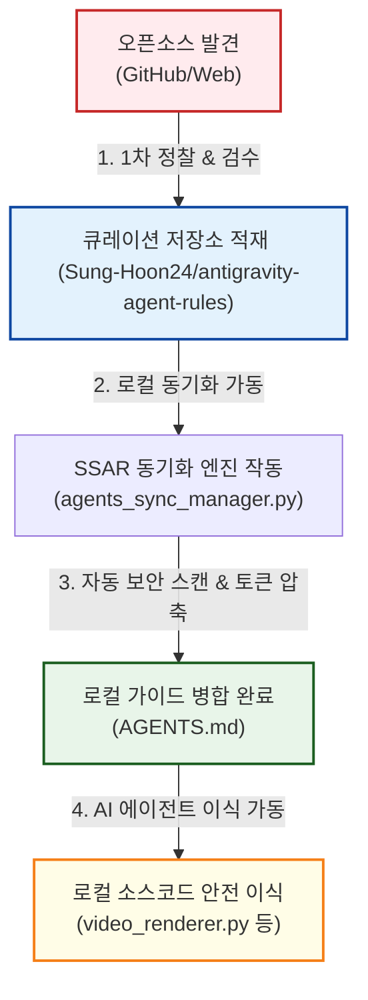

# WebGL PoC System Core (v1.0) & 🤖 유튜브에이전트

> [!IMPORTANT]
> **🔗 연결된 실제 바탕화면 봇 기동 정보**
>
> - **유튜브에이전트 채널제어 원격 콘솔 봇**
>   - **바탕화면 아이콘**: `[유튜브에이전트]_채널제어_원격_콘솔_봇`
>   - **대상 파일 및 포트**: [Runbot_Console_Launcher.bat](file:///C:/1인기업/Apps/유튜브에이전트/Runbot_Console_Launcher.bat) (Port: `8000`의 Web Server 및 `5000`의 State Machine API)
>   - **기능**: 유튜브 채널별 업로드 상태 확인, 텔레그램 연동 원격 모니터링 데몬들의 동작 감시, 웹 기반 통합 TUI/Web 대시보드 기동 및 프로세스 강제 정리.
>   - **아이콘 이미지**: 본 프로젝트 폴더 하위의 [stitch_console.ico](file:///C:/1인기업/Apps/유튜브에이전트/assets/stitch_console.ico) (귀여운 스티치 스타일 원격 콘솔 아이콘)를 바탕화면 아이콘으로 탑재하고 있습니다.

이 프로젝트는 시스템적 실패 경험을 시각화하는 웹 기반 PoC의 핵심 모듈 API와 상태 관리자입니다.
모든 개발자는 [IWebGlModule.ts] 인터페이스를 엄격히 준수해야 합니다.

---

## 🧠 🤖 에이전트 로컬 지식 순환 시스템 (Chroma RAG DB)

우리가 겪은 에러 경험을 일기장에 적으면, AI가 쉽게 찾을 수 있도록 보물 지도에 좌표를 매겨 비밀 보물상자(Chroma DB)에 공짜로 넣어둔 뒤, 다음번에 비슷한 일이 생기면 보물상자에서 먼저 꺼내서 보고 실수를 예방하는 핵심 지식 시스템입니다.

### 📊 1. 지식 순환 흐름도 (Data Lifecycle)



---

### 🎒 [초등 버전] "내 방의 똑똑한 비밀 오답노트 책장"

1. **오답노트 쓰기 (로컬 저장)**
   - 학교에서 시험을 보다가 틀린 문제가 생기면 오답노트에 적어두죠? 저희도 코딩을 하다가 포트 충돌이나 경로 파일이 깨지는 실수가 생기면, 내 컴퓨터의 [로컬지식/errors](file:///c:/1인기업/Apps/1.유튜브에이전트/로컬지식/errors)라는 일기장 폴더에 한글로 꼼꼼하게 일기를 써서 저장해요.
2. **보물 지도 그리기 (데이터 축적 원리)**
   - 책이 너무 많아지면 찾기 힘드니까, 책에 **"이 오답노트는 5층 3열 서랍에 들어갈 내용이야"** 하고 위치 스티커(좌표)를 붙여요. 인공지능은 글자보다 이 스티커 좌표를 따라 책을 찾는 게 훨씬 빠르거든요. 이 스티커를 붙여서 차곡차곡 모아두는 책장 이름이 바로 **크로마(Chroma) DB**예요.
3. **용돈이 드나요? (과금 설명)**
   - 이 튼튼한 책장은 내 컴퓨터 방에 직접 공짜로 설치한 것이라 **보관료가 0원**이에요. 인터넷 클라우드를 안 쓰니까요!
   - 다만, 오답노트 일기장을 보고 위치 스티커를 인공지능용 좌표로 번역할 때 구글 서비스에 몇 글자 물어보는데, 이때 드는 비용은 글자 1,000자당 몇 원 수준으로 아주 미세해서 대표님 지갑에는 거의 부담이 없답니다.
4. **진짜 내 컴퓨터에 있나요?**
   - 네! 대표님의 컴퓨터 C드라이브 안의 [local_fallback_db.json](file:///c:/1인기업/Apps/1.유튜브에이전트/outputs/chroma_db/local_fallback_db.json) 파일 속에 비밀 서랍장이 완전히 보관되어 있어요.

---

### 🎓 [중등 버전] "RAG 아키텍처 및 로컬 벡터 데이터베이스"

1. **RAG(검색 증강 생성)란?**
   - AI가 모르는 내용을 임의로 지어내는 환각(Hallucination) 현상을 방지하기 위해, 사용자의 질문과 가장 연관성이 높은 문서(지식)를 로컬 데이터베이스에서 **먼저 검색(Retrieval)하여 컨텍스트로 제공한 뒤 답변을 생성(Generation)**하게 만드는 똑똑한 검색 아키텍처입니다.
2. **임베딩(Embedding)과 벡터 DB (데이터 축적 원리)**
   - 우리가 작성한 마크다운 에러 문서(`*.md`)는 자연어(텍스트) 상태입니다.
   - AI가 이 텍스트들의 '의미적 유사도'를 판별할 수 있도록 다차원 공간 상의 숫자 좌표계인 **임베딩 벡터(Embedding Vector)**로 변환합니다.
   - 변환된 수치 좌표들을 인덱싱하여 보관하고 시맨틱 검색(유사 의미 검색)을 신속하게 수행하는 데이터베이스가 바로 **Chroma 로컬 DB**입니다.
3. **과금 구조 분석 (API Cost)**
   - **데이터 스토리지**: Chroma DB는 로컬 가상 파일 기반(`outputs/chroma_db`)으로 상시 구동되므로 **호스팅 및 클라우드 저장 비용이 전혀 발생하지 않습니다 (Free).**
   - **텍스트 변환 비용**: 자연어를 임베딩 벡터로 변환하는 과정에서 Google Gemini API의 임베딩 모델(`text-embedding-004`) 등을 호출합니다. 이 API 비용은 입력 토큰(Token) 수 기준으로 청구되며, 매우 저렴하여 대량의 문서를 매일 새로 등록하더라도 미미한 수준의 리소스 과금만 발생합니다.
4. **로컬 저장 및 격리성 (Data Security)**
   - 모든 가공된 지식과 임베딩 데이터셋은 로컬 드라이브 경로인 [local_fallback_db.json](file:///c:/1인기업/Apps/1.유튜브에이전트/outputs/chroma_db/local_fallback_db.json)에 격리 보관되므로, 외부로 기업 기밀이나 고유 소스코드가 노출되지 않는 높은 보안 안정성을 확보하고 있습니다.

---

## 📈 지식 족보 자가 업그레이드 및 진화 파이프라인 (R&D Evolution)

AI 에이전트가 시간이 흐를수록 과거의 에러 실수를 극복하고, 대표님의 최신 브랜드 연출 결정을 기억하여 지식이 자가 성장할 수 있도록 설계된 하이브리드 학습 순환 체계입니다.

### 📊 1. 자가 진화 3대 파이프라인 구조



*   **① 수동 규칙 학습 (Explicit Learning)**:
    *   대표님과의 대화 중 "Aura 서명을 우측 하단에 각인해줘"와 같은 새로운 튜닝 결정이 완료되었을 때 대표님이 대화창에 **`/learn`** 슬래시 명령어를 입력하면, AI 에이전트가 배운 지식을 [AGENTS.md](file:///c:/1인기업/Apps/1.유튜브에이전트/.agents/AGENTS.md)에 정식 박제하고 원격 저장소(`antigravity-agent-rules`)로 Push하여 백업을 자동화합니다.
*   **② 자동 에러 학습 (Self-Diagnostic Learning)**:
    *   R&D 및 시스템 실행 중 마주친 오류 해결책을 오답노트로 적으면 자동으로 로컬 벡터 책장인 [Chroma DB](file:///c:/1인기업/Apps/1.유튜브에이전트/outputs/chroma_db/local_fallback_db.json)에 임베딩 인덱싱 처리합니다. 이후 유사한 상황 발생 시 AI가 오답노트를 선제적으로 읽어 실수를 스스로 회피합니다.
*   **③ 물리 기능 확장 (Skill Expansion)**:
    *   새로운 영상 연출 필터, 폰트 자산 등이 요구되면 `.agents/skills/` 디렉토리에 새로운 스킬 패키지로 장착되어 에이전트의 물리적인 동작 스펙이 계속 팽창합니다.

> [!IMPORTANT]
> **💡 하이브리드(Hybrid) 지식 보존 원칙**:
> 문장과 기획안을 수려하게 가공하는 언어 지능은 외부 클라우드인 **Gemini API**를 외주로 저렴하게 호출하여 쓰되, 핵심 브랜드 레시피와 구도 족보, 오류 지식들은 100% **로컬 Chroma DB와 스킬 자산**으로 대표님 PC 내부에 격리 보존 관리하여 절대적인 기밀 보안과 0원의 영구 유지 비용을 실현합니다.

---

## 🛠️ 유튜브 에이전트 핵심 스킬 라이브러리 (Agent Skills Directory)

프로젝트 내에서 AI 에이전트들이 특정 업무를 수행할 때 참고하는 핵심 기술 지침 및 기능 파일들의 물리적 절대 경로와 역할 요약입니다.

| 번호 | 스킬 이름 | 로컬 절대 경로 | 주요 역할 및 기능 |
| :--- | :--- | :--- | :--- |
| **01** | **[1.고화질_지터리스_줌인_엔진](file:///c:/1인기업/Apps/1.유튜브에이전트/.agents/skills/1.고화질_지터리스_줌인_엔진/SKILL.md)** | `c:\1인기업\Apps\1.유튜브에이전트\.agents\skills\1.고화질_지터리스_줌인_엔진\SKILL.md` | FFmpeg의 zoompan 일렁임(stutter)을 3840x2160 해상도 기반 1px 크롭 및 Lanczos 다운스케일러로 완전히 극복하는 초고화질 줌인 렌더링 공식 제공. |
| **02** | **[2.경량_켄번즈_줌인_엔진](file:///c:/1인기업/Apps/1.유튜브에이전트/.agents/skills/2.경량_켄번즈_줌인_엔진/SKILL.md)** | `c:\1인기업\Apps\1.유튜브에이전트\.agents\skills\2.경량_켄번즈_줌인_엔진\SKILL.md` | 빠른 프리프로덕션 컴파일 및 하드웨어 리소스 최적화가 필요할 때 2배 오버샘플링 후 기본 zoompan 연산으로 줌인 비디오를 생성하는 가이드 제공. |
| **03** | **[3.고대비_ASS_자막_스타일링](file:///c:/1인기업/Apps/1.유튜브에이전트/.agents/skills/3.고대비_ASS_자막_스타일링/SKILL.md)** | `c:\1인기업\Apps\1.유튜브에이전트\.agents\skills\3.고대비_ASS_자막_스타일링\SKILL.md` | 배경의 픽셀 간섭을 우회하여 시인성을 100% 보장하기 위한 1px 아웃라인 및 1px 드롭 섀도우를 갖춘 Advanced Substation Alpha 자막 스타일 정의. |
| **04** | **[4-1.필로우_타이핑_인트로_모션](file:///c:/1인기업/Apps/1.유튜브에이전트/.agents/skills/4-1.필로우_타이핑_인트로_모션/SKILL.md)** | `c:\1인기업\Apps\1.유튜브에이전트\.agents\skills\4-1.필로우_타이핑_인트로_모션\SKILL.md` | 유튜브 초반 이탈률 방지를 위해 글자가 한 글자씩 차오르고 2Hz 주기로 깜빡이는 타이핑 효과를 Pillow 드로잉과 FFmpeg 파이프라인으로 구현하는 SOP. |
| **05** | **[4-2.필로우_날아오기_인트로_모션](file:///c:/1인기업/Apps/1.유튜브에이전트/.agents/skills/4-2.필로우_날아오기_인트로_모션/SKILL.md)** | `c:\1인기업\Apps\1.유튜브에이전트\.agents\skills\4-2.필로우_날아오기_인트로_모션\SKILL.md` | 화면 외부 상단부에서 목표 지점까지 감속(Ease-Out Cubic)하여 우아하게 내려앉는 날아오기 효과의 물리 공식 및 배치 규격 가이드. |
| **06** | **[4-3.필로우_시차페이드인_인트로_모션](file:///c:/1인기업/Apps/1.유튜브에이전트/.agents/skills/4-3.필로우_시차페이드인_인트로_모션/SKILL.md)** | `c:\1인기업\Apps\1.유튜브에이전트\.agents\skills\4-3.필로우_시차페이드인_인트로_모션\SKILL.md` | 개별 문자마다 4프레임의 시간차(Stagger) 지연을 부여하고 12프레임간 투명도(Alpha)를 전이시켜 신비롭게 그리는 페이드인 기법 설명. |
| **07** | **[vfx-video-compositor](file:///c:/1인기업/Apps/1.유튜브에이전트/.agents/skills/vfx-video-compositor/SKILL.md)** | `c:\1인기업\Apps\1.유튜브에이전트\.agents\skills\vfx-video-compositor\SKILL.md` | 고화질 지터리스 줌, 고대비 자막, Pillow 텍스트 모션 및 기획안 연출 파라미터를 통합 연동/제어하기 위한 VFX 통합 안내서. |
| **08** | **[stitch-dashboard-builder](file:///c:/1인기업/Apps/1.유튜브에이전트/.agents/skills/stitch-dashboard-builder/SKILL.md)** | `c:\1인기업\Apps\1.유튜브에이전트\.agents\skills\stitch-dashboard-builder\SKILL.md` | Stitch AI를 통한 UI 디자인 시안 도출 및 백그라운드 런봇 제어용 HTML 대시보드, 윈도우 배치 런처의 전체 구축 워크플로우 가이드. |
| **09** | **[security-shield-guard](file:///c:/1인기업/Apps/1.유튜브에이전트/.agents/skills/security-shield-guard/SKILL.md)** | `c:\1인기업\Apps\1.유튜브에이전트\.agents\skills\security-shield-guard\SKILL.md` | API Key, OAuth, 텔레그램 토큰, 로컬 OS 경로 등 민감정보의 외부 유출 및 로그 기록 노출을 사전에 완벽히 마스킹(차단)하는 보안 스킬. |
| **10** | **[character-asset-labeler](file:///c:/1인기업/Apps/1.유튜브에이전트/.agents/skills/character-asset-labeler/SKILL.md)** | `c:\1인기업\Apps\1.유튜브에이전트\.agents\skills\character-asset-labeler\SKILL.md` | 캐릭터 페르소나 이미지 하단에 프리미엄 그라데이션 바와 이름/역할 레이블을 Pillow로 합성하여 채팅창의 토큰 낭비를 절감하는 유틸리티 스킬. |
| **11** | **[youtube-thumbnail-generator](file:///c:/1인기업/Apps/1.유튜브에이전트/.agents/skills/youtube-thumbnail-generator/SKILL.md)** | `c:\1인기업\Apps\1.유튜브에이전트\.agents\skills\youtube-thumbnail-generator\SKILL.md` | Gemini 3 Pro Image (나노 바나나 프로) 및 20종 명화 화풍 썸네일 대시보드를 안정적으로 관리하고 자막 X,Y 2축 배치 슬라이더를 제공하는 스킬. |
| **12** | **[youtube-growth-master](file:///c:/1인기업/Apps/1.유튜브에이전트/.agents/skills/youtube-growth-master/SKILL.md)** | `c:\1인기업\Apps\1.유튜브에이전트\.agents\skills\youtube-growth-master\SKILL.md` | 유튜브 Data API v3를 활용하여 대표님의 채널별 성장 추이, 댓글 참여도를 계측하고 조회수 성장을 위한 A/B 테스트 전략을 분석하는 통계 스킬. |
| **13** | **[포트저격-통신교통정리기](file:///c:/1인기업/Apps/1.유튜브에이전트/.agents/skills/포트저격-통신교통정리기/SKILL.md)** | `c:\1인기업\Apps\1.유튜브에이전트\.agents\skills\포트저격-통신교통정리기\SKILL.md` | 로컬 서버 가동 중 빈번한 8000/5000 포트 충돌 및 좀비 백그라운드 프로세스를 핀포인트로 탐색/종료하고 대화식으로 항구를 청소하는 정비 스킬. |
| **14** | **[rag-performance-diagnoser](file:///c:/1인기업/Apps/1.유튜브에이전트/.agents/skills/rag-performance-diagnoser/SKILL.md)** | `c:\1인기업\Apps\1.유튜브에이전트\.agents\skills\rag-performance-diagnoser\SKILL.md` | 지식 검색 엔진(RAG)의 응답 지연 시간, 검색 적중률, 문서 커버리지 및 동기화 무결성을 측정하고 교정용 진단 등급(A~F)을 출력하는 진단 스킬. |
| **15** | **[5.바탕화면_원격_제어_런처_관리](file:///c:/1인기업/Apps/1.유튜브에이전트/.agents/skills/5.바탕화면_원격_제어_런처_관리/SKILL.md)** | `c:\1인기업\Apps\1.유튜브에이전트\.agents\skills\5.바탕화면_원격_제어_런처_관리\SKILL.md` | 바탕화면 `BOT` 폴더의 단축 아이콘 런처 자산들과 이 프로젝트 내 실제 실행 파일(Runbot, 썸네일 대시보드) 간의 연결 무결성을 관리하는 스킬. |
| **16** | **[6.슬로우_줌인아웃_루프_엔진](file:///c:/1인기업/Apps/1.유튜브에이전트/.agents/skills/6.슬로우_줌인아웃_루프_엔진/SKILL.md)** | `c:\1인기업\Apps\1.유튜브에이전트\.agents\skills\6.슬로우_줌인아웃_루프_엔진\SKILL.md` | 정지 이미지를 실수형 부동소수점 수준에서 줌인(40초) 후 줌아웃(40초) 무한 루프하여 툭툭 끊김과 일렁임을 100% 제거하고 80초 비디오 클립으로 렌더링하는 OpenCV 서브픽셀 Lanczos4 줌 스킬. |
| **17** | **[7.브랜드_폰트_융합_엔진](file:///c:/1인기업/Apps/1.유튜브에이전트/.agents/skills/7.브랜드_폰트_융합_엔진/SKILL.md)** | `c:\1인기업\Apps\1.유튜브에이전트\.agents\skills\7.브랜드_폰트_융합_엔진\SKILL.md` | 대문자(Arial Bold)와 소문자(Georgia Bold Italic)를 fontTools로 병합하고 12도 기울임 물리 변형을 가해 자사 서체 RubiaHybrid.ttf를 생산하는 스킬. |

---

## 🎨 고유 브랜드 융합 창조 자산 (Brand Fonts)

유튜브 자막 렌더링, 채널 브랜딩 및 썸네일 제작 시 일관된 브랜드 정체성을 유지하고 저작권 충돌을 차단하기 위해 규격화한 자사 고유의 융합/자체개발 서체 자산입니다.

### 📊 1. 브랜드 폰트 자산 현황 및 경로

| 서체 명칭 | 실물 파일명 | 로컬 저장소 절대 경로 | 스킬 내 백업 자산 경로 | 주요 디자인 특징 및 용도 |
| :--- | :--- | :--- | :--- | :--- |
| **브랜드 폰트 1** | `RubiaHybrid.ttf` | [RubiaHybrid.ttf](file:///c:/1인기업/Apps/1.유튜브에이전트/outputs/RubiaHybrid.ttf) | [RubiaHybrid.ttf](file:///c:/1인기업/Apps/1.유튜브에이전트/.agents/skills/7.브랜드_폰트_융합_엔진/resources/RubiaHybrid.ttf) | Arial Bold(대문자) + Georgia Bold Italic(소문자) 교차 융합 및 12도 우측 기울임(Skew) 물리 변형을 가한 자사 독창적 필기형 산세리프-세리프 혼합 서체. |
| **브랜드 폰트 2** | `georgiabi.ttf` | [georgiaz.ttf](file:///C:/Windows/Fonts/georgiaz.ttf) | [georgiabi.ttf](file:///c:/1인기업/Apps/1.유튜브에이전트/.agents/skills/7.브랜드_폰트_융합_엔진/resources/georgiabi.ttf) | Georgia Bold Italic 원본. 은하수 밤하늘, 파란 바다 등 내추럴한 명상/치유(Aura Serenity Wellness) 채널의 시그니처 썸네일 타이틀 전용 폰트. |

> [!IMPORTANT]
> **🚨 핵심 키워드 호출 지침 (Core Command Override)**
> 대화창에서 `브랜드 폰트`, `융합폰트`, `자체개발폰트` (대소문자/공백 무관) 등의 단어가 언급되면, 에이전트는 본 섹션의 브랜드 폰트 자산 일람 표를 대화 최상단 또는 답변 초입에 반드시 정식 로드하여 사용자에게 보여주어야 합니다.

---

## 🛡️ 깃허브 연동형 양방향 AI 지침 자동 동기화 엔진 (SSAR - Sync Shield Agent Rules)

대표님의 전용 큐레이션 저장소(GitHub)와 로컬 에이전트 지침서([AGENTS.md](file:///c:/1인기업/Apps/1.유튜브에이전트/.agents/AGENTS.md)) 간의 1:1 양방향 룰셋 자동 순환 및 보안 검수 파이프라인입니다.

### 📊 1. SSAR 연동 아키텍처 흐름도



### ⚙️ 2. 핵심 기능 및 R&D 보안/연구 균형화 (SecOps Balance)

- **1:1 큐레이션 저장소 (Curation Repository)**: 외부 소스를 직접 당겨오지 않고 대표님이 검수 완료한 깃허브 저장소([antigravity-agent-rules](https://github.com/Sung-Hoon24/antigravity-agent-rules.git))를 거침으로써 외부 해킹과 링크 유실(404) 위험을 원천 차단합니다.
- **브랜치 교차 폴백 (Fallback)**: 원격 다운로드 시 기본 `main` 브랜치가 유실되었거나 부재할 경우 자동으로 `master` 브랜치를 탐색해 우회 다운로드합니다.
- **토큰 압축 (Markdown Minifier)**: 주석 제거, 다중 개행 축소, 링크 간소화 모듈을 통해 AI가 매번 읽어 들이는 프롬프트 텍스트 토큰 양을 극적으로 압축 세이브합니다.
- **개발자 연구 편의성 확보 (SecOps Trade-off)**:
  - **Dev Mode (`dev_mode: true`)**: 보안 감시 중 위배 키워드(`subprocess.Popen` 등)가 감지되어도 작업을 강제 차단하지 않고 경고 로그만 남기며 통과시켜 연구 및 디버깅의 효율성을 보장합니다.
  - **해시 프리패스 (SHA-256)**: 이미 검증 완료되어 `trusted_hashes`에 등록된 해시값을 가진 파일은 보안 스캔을 패스(Bypass)하여 0.1초 만에 로드합니다.
  - **1회성 오버라이드 플래그**: 설정 내 `bypass_security_once: true` 선언 시 1회에 한해 모든 보안 스캔을 패스한 뒤 즉시 `false`로 자동 복구하여 실수를 방지합니다.

### 📁 3. 연동 파일 위치 정보

- **로컬 설정**: [.agents/sync_config.json](file:///c:/1인기업/Apps/1.유튜브에이전트/.agents/sync_config.json)
- **제어 스크립트**: [.agents/scripts/agents_sync_manager.py](file:///c:/1인기업/Apps/1.유튜브에이전트/.agents/scripts/agents_sync_manager.py)
- **원격 큐레이션 저장소**: [Sung-Hoon24/antigravity-agent-rules](https://github.com/Sung-Hoon24/antigravity-agent-rules.git)

### 🏗️ 4. 신규 프로젝트 내 SSAR 재구축 및 설계 방법 (SOP)

향후 새로운 독립 프로젝트나 완전히 빈 워크스페이스에 이와 같은 **보안 동기화 파이프라인을 재설계하고 연동할 때의 작업 순서 가이드라인**입니다.

#### ① 원격 저장소(GitHub) 개설 및 룰셋 준비

1. 깃허브 로그인 후, 새로운 저장소(예: `antigravity-agent-rules`)를 생성합니다.
   - 🔒 **보안 권고**: 노하우 유출을 막기 위해 **Private(비공개)**로 개설하는 것을 권장합니다.
2. 저장소 루트에 `.agents` 폴더를 생성하고, 그 안에 규칙을 담을 `AGENTS.md` 파일을 빈 상태로 커밋해 둡니다.

#### ② 로컬 설정 및 동기화 스크립트 설계

1. **설정 파일 (`sync_config.json`) 설계**:
   - 1:1 연동을 위해 `curation_repo_url`, `dev_mode`, `bypass_security_once`, `trusted_hashes` 변수를 정의한 JSON 파일을 로컬 `.agents/` 내에 배치합니다.
2. **동기화 파이프라인 스크립트 (`agents_sync_manager.py`) 작성**:
   - **PULL 로직**: `urllib.request`를 사용해 깃허브 웹 주소를 raw 주소(`raw.githubusercontent.com`)로 동적 변환하여 단일 텍스트를 다운로드합니다. 이 때 `main` 브랜치 실패 시 `master` 브랜치 주소로 우회 복구하는 `Fallback` 함수를 이식합니다.
   - **압축기 (Minifier)**: 토큰 과금 방지를 위해 불필요 주석(`//`, `#`) 및 다중 개행문자(`\n\n\n`)를 정규식으로 축소 처리하는 필터를 작성합니다.
   - **보안 검수 (Security Scan)**: `rm -rf`, `ignore instructions` 등 프롬프트 인젝션 키워드를 탐지하는 Regex 검사기를 작성합니다.
   - **SecOps 제어**: `dev_mode: true`일 때는 보안 위배 감지 시 차단하지 않고 warning 로그만 남기며 넘어가도록 분기하고, 해시(`SHA-256`) 검증 성공 시 스캔을 생략하는 Bypass 장치와 일회성 오버라이드 복구 로직을 구현합니다.
   - **PUSH 로직**: `subprocess`를 통해 `git commit --no-verify`로 로컬 pre-commit 훅 간섭을 피하며 `git push`를 자동 수행하는 업로드 명령을 기재합니다.

#### ③ 로컬 규칙 파일 구획 분리

- 로컬 `AGENTS.md` 파일 하단에 `<!-- GITHUB_SYNC_RULES_START -->`와 `<!-- GITHUB_SYNC_RULES_END -->` 주석 태그를 미리 선언하여, 동기화 스크립트가 로컬 규칙을 오염시키지 않고 해당 영역에만 압축 병합(Merge)을 수행하도록 구획을 나눕니다.

#### ④ 로컬 Git 원격지 연결 및 최초 1회 수동 로그인 (인증 연동)

1. 로컬 프로젝트 터미널에서 깃허브 주소를 origin으로 등록합니다:

     ```powershell
     git remote add origin https://github.com/대표님계정/antigravity-agent-rules.git
     ```

2. **[🚨 핵심 우회 요건]** 백그라운드 봇이 로그인 창 데드락에 걸리는 것을 막기 위해, 개발자가 최초 1회 터미널에서 **수동으로 `git push -u origin master`를 직접 실행**합니다.
   - 이 때 모니터 화면에 나타나는 깃허브 브라우저 인증(Credential Helper)을 승인하여 로컬 PC 자격 증명에 토큰을 영구 기억시킵니다.
3. 이후 `python .agents/scripts/agents_sync_manager.py --sync-test`를 실행하여 무점검·자동화 동기화가 정상 작동하는지 무결성을 확인합니다.

---

### 🛡️ 5. 외부 오픈소스 및 템플릿 코드 안전 이식 지침 (SecOps Open-Source Integration SOP)

대표님이 외부 깃허브에서 유용한 오픈소스 코드(FFmpeg 필터, Pillow 모션 그래픽, 비디오 렌더러 예제 등)를 가져와 로컬 프로젝트에 적용할 때, **보안 사고와 샌드박스 오염을 원천 차단하고 효율적으로 코드를 주입하는 4단계 표준 프로세스**입니다.



#### [1단계] 🔍 1차 수동 정찰 및 큐레이션 저장소 등록

- **목적**: 오염된 외부 깃허브 코드가 로컬 PC에 직접 다운로드되는 것을 물리적으로 차단합니다.
- **액션**:
  1. 외부 오픈소스 파일 내용을 브라우저로 먼저 살펴보고, 악성 백도어나 비인가 쉘 명령어(`rm -rf`, `os.system` 등)가 노출되어 있는지 수동으로 1차 검수합니다.
  2. 검수가 통과되면, 가져올 코드의 핵심 동작 특징이나 템플릿 사용법을 대표님의 전용 큐레이션 저장소(`antigravity-agent-rules`)의 `.agents/AGENTS.md`에 **표준 룰 가이드 형식으로 기재하여 직접 Push(업로드)**합니다.

#### [2단계] ⚙️ SSAR 엔진 가동 (로컬 동기화 및 2차 보안 검수)

- **목적**: 큐레이션 저장소로부터 데이터를 가져오면서 보안 필터링과 토큰 절감 처리를 자동으로 병행합니다.
- **액션**:
  - 로컬 터미널에서 `python .agents/scripts/agents_sync_manager.py --pull`을 구동시킵니다.
  - 이 과정에서 엔진 내부의 **`scan_security()` 검사기**가 OWASP Top 10 기준의 악성 인젝션 패턴이 들어있는지 2차 정밀 기계적 스캔을 진행합니다.
  - **`token_minify` 기능**이 작동하여 가져온 오픈소스의 군더더기 주석과 여백을 자동으로 압축하여 AI 에이전트의 컨텍스트 용량을 절감시킵니다.

#### [3단계] 🤝 안전한 룰셋 병합 (`AGENTS.md`)

- **목적**: 로컬 에이전트에게 어떤 보안 규격과 가이드라인으로 외부 소스코드를 적용할지 안전하게 학습시킵니다.
- **액션**:
  - 스캔과 압축이 끝난 규칙 가이드가 로컬 [.agents/AGENTS.md](file:///c:/1인기업/Apps/1.유튜브에이전트/.agents/AGENTS.md) 파일의 지정된 블록 내부에 안전하게 결합됩니다.

#### [4단계] 🤖 AI 에이전트를 통한 로컬 실무 파일 안전 이식

- **목적**: 룰셋을 완벽히 공부한 AI 에이전트가 로컬 소스코드에 실질적인 기능을 안전 주입합니다.
- **액션**:
  - 대표님이 에이전트에게 *"방금 룰셋에 병합된 오픈소스 기능을 참고해서 [video_renderer.py](file:///c:/1인기업/Apps/1.유튜브에이전트/telegram_bot/engine/video_renderer.py)에 이식해 줘"* 라고 명령을 내립니다.
  - AI 에이전트는 로컬 `AGENTS.md`에 결합된 안전 가이드를 엄격히 준수하며 실무 소스코드를 수정 및 통합하여 완성합니다.

---

## 🧹 마크다운 자동 포맷 및 린트 방어 시스템 (Auto-Formatter & Lint Shield)

동기화 병합 및 로컬 작업 중 빈번히 발생하는 마크다운 린트 에러(연속 빈 줄, 코드 펜스 공백, 자식 인덴트 들여쓰기 꼬임)를 실시간 자동 교정하여 워크스페이스의 규격 무결성을 가드하는 자동화 방어막입니다.

### 📊 1. 린트 방어 기술 스펙 (VS Code settings.json)

로컬 지침서 작성 시, 저장(Ctrl + S)하는 순간 포매터가 정렬을 자동 가동합니다.

- **설정 파일**: [.vscode/settings.json](file:///c:/1인기업/Apps/1.유튜브에이전트/.vscode/settings.json)

- **적용 스펙**:

  ```json
  "[markdown]": {
    "editor.defaultFormatter": "DavidAnson.vscode-markdownlint",
    "editor.formatOnSave": true
  }
  ```

### ⚙️ 2. 동기화 엔진 내의 마크다운 자동 포맷 및 이스케이프 이중 필터 소스

원격 저장소 룰을 당겨와 로컬 지침서에 결합할 때, 쓰기 직전 린트 규격을 자동 정돈하고 역슬래시 예외를 완벽 방어하는 SSAR 파이프라인 핵심 로직입니다.

- **스크립트**: [.agents/scripts/agents_sync_manager.py](file:///c:/1인기업/Apps/1.유튜브에이전트/.agents/scripts/agents_sync_manager.py)

- **핵심 소스코드**:

```python
def format_markdown_rules(text: str) -> str:
    """[코디아 정돈 헬퍼] 마크다운 문서 내의 린트 에러(연속 빈 줄, 인덴트 정렬, 코드 펜스 주변 개행 등)를 정적 보정합니다."""
    if not text:
        return ""
    
    # 1. 연속된 빈 줄을 최대 1개로 단일화 (MD012 대응)
    processed = re.sub(r"\n{3,}", "\n\n", text)
    
    # 2. 코드 블록(```) 위아래에 빈 줄이 없는 경우 강제 삽입 (MD031 대응)
    lines = processed.split("\n")
    formatted_lines = []
    in_code_block = False
    
    for i, line in enumerate(lines):
        stripped = line.strip()
        if stripped.startswith("```"):
            in_code_block = not in_code_block
            if in_code_block and i > 0 and formatted_lines and formatted_lines[-1].strip() != "":
                formatted_lines.append("")
            formatted_lines.append(line)
            continue
            
        if not in_code_block and formatted_lines and formatted_lines[-1].strip().startswith("```"):
            if stripped != "":
                formatted_lines.append("")
        
        formatted_lines.append(line)
        
    processed = "\n".join(formatted_lines)
    
    # 3. 비정상적으로 스페이스 1개로 들여쓰기 된 하위 리스트 항목 보정 (MD005, MD007 대응)
    processed = re.compile(r"^ ([-*]\s)", re.MULTILINE).sub(r"  \1", processed)
    processed = re.compile(r"^ (\d+\.\s)", re.MULTILINE).sub(r"  \1", processed)
    
    return processed
```

- **역슬래시 `bad escape` 런타임 오류 방어 (Lambda Wrapper)**:

  - 텍스트 치환 결과물에 `\x` 와 같은 이스케이프 문자열이 들어있을 때 regex 엔진 오독으로 인한 크래시를 원천 회피하기 위해, 람다 함수로 래핑하여 리터럴 텍스트 치환을 안전하게 보장합니다.

```python
# 💡 lambda m: combined_block 래핑으로 백슬래시 오독 크래시 방지
if re.search(pattern, content, re.DOTALL):
    new_content = re.sub(pattern, lambda m: combined_block, content, flags=re.DOTALL)
```

### 🧪 3. 린트 무결성 자가 검증 시나리오

- **실행 명령**:

  ```powershell
  python .agents/scripts/agents_sync_manager.py --sync-test
  ```

- **검증 프로세스**:

  1. 큐레이션 저장소의 원격 지침 다운로드.
  2. OWASP Top 10 보안 위배 스캔 (`scan_security`).
  3. 토큰 절감 압축 (`minify_rules`).
  4. 로컬 `AGENTS.md` 동적 람다 치환 병합.
  5. 정적 포매터(`format_markdown_rules`) 자동 구동을 통한 린트 오류 실시간 자가 정돈.
  6. 최종 `결과: ✅ 성공` 획득 검증 완료.
