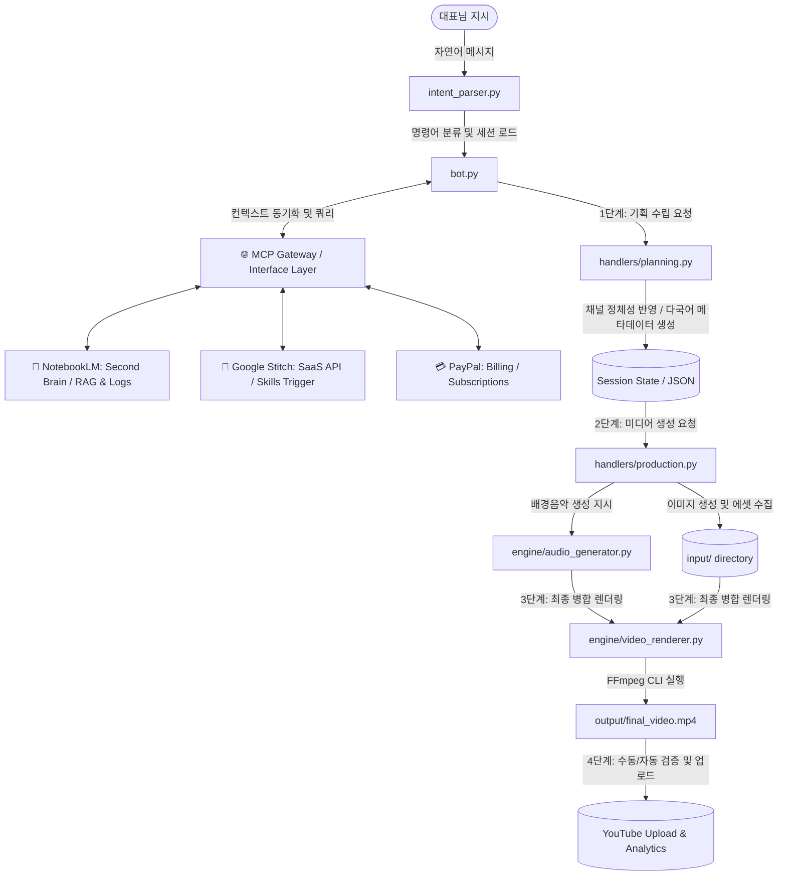
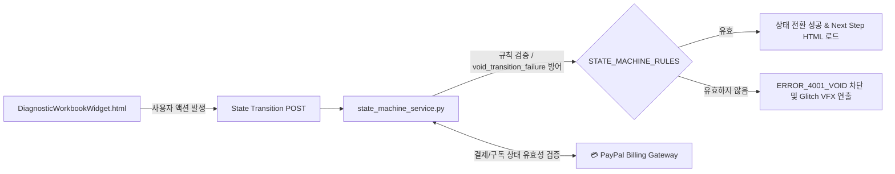

# 🗺️ 유튜브 에이전트 프로젝트 내비게이터 (Project Navigator)

본 문서는 프로젝트의 **기술 총괄(Tech Lead)** 관점에서 작성된 개발/디버깅 내비게이터입니다.
AI 엔진은 코드를 수정하거나 분석하기 전에 **이 문서를 가장 먼저 로드하여 데이터의 길목과 의존성을 파악**해야 하며, 임의적인 리팩토링이나 범위 외 수정을 방지하는 안전 가이드라인을 엄격히 준수해야 합니다.

---

## 1. 📂 전체 소스 구조도 (High-Level Source Tree)

프로젝트 내부의 핵심 폴더 및 파일의 역할과 구성도입니다. 불필요한 세부 함수 수준의 묘사는 생략하고, 기능적 뼈대 중심으로 나열되었습니다.

```text
c:\1인기업\Apps\유튜브에이전트
├── 🤖 telegram_bot/               # 텔레그램 봇 메인 애플리케이션
│   ├── bot.py                     # 봇의 메인 엔트리포인트 및 메시지 디스패처 (라우터)
│   ├── config.py                  # 채널 매칭 규칙, API 키, 로컬 토큰 설정 파일
│   ├── nlp/                       # 자연어 처리 및 사용자 의도 분석 모듈
│   │   ├── intent_parser.py       # 사용자 입력 분석 후 명령어/동작으로 매핑
│   │   └── rag_validator.py       # RAG 유입 데이터 오염 방지 무결성 게이트 (NEW)
│   ├── handlers/                  # 대화 단계별 구체적 비즈니스 로직 핸들러
│   │   ├── basic.py               # 기본 인사 및 도움말 처리
│   │   ├── planning.py            # 콘텐츠 기획 수립, 타이틀/태그/설명 및 다국어 메타데이터 생성
│   │   ├── production.py          # 미디어 생성(이미지/오디오) 및 FFmpeg 렌더링 호출 통제
│   │   └── channel_stats.py       # YouTube Data API v3를 활용한 성과 분석 및 댓글 수집
│   └── engine/                    # 미디어 처리 및 데이터 소스 조회 물리 엔진
│       ├── audio_generator.py     # AI 배경음악(BGM) 컴포지션 파이프라인
│       ├── video_renderer.py      # 이미지/오디오/자막 및 VFX 핫스왑 로더 탑재 렌더링
│       ├── llm_client.py          # LLM 호출 및 번역 공통 API 클라이언트
│       ├── rag_retriever.py       # RAG 기반의 기존 가이드라인 및 규칙 로더
│       └── feedback_loop.py       # 닫힌 루프 성과 환류 제어 엔진 (NEW)
│
├── 🔌 plugins/                    # R&D Lab 핫스왑 플러그인 보관소
│   ├── enabled/                   # [런타임 가동] 실제 로드되어 동작할 검증 완료 플러그인 (.py)
│   └── disabled/                  # [대기 상태] 검증 완료 후 대표 최종 승인 대기 중인 플러그인
│
├── ⚙️ run_bot/                     # 봇 구동용 실행 및 설정 헬퍼 스크립트 모음
│   ├── check_tokens.py            # 유튜브 API 인증 토큰 유효성 검사기
│   ├── run_bot.ps1                # 텔레그램 봇 기동용 파워쉘 스크립트
│   └── run_bot_*.bat              # 각 채널별 에이전트(Rubia, Aura, SmartAgeTech) 전용 기동 배치파일
│
├── 🌐 웹 서비스 & 상태 제어기 (웹 퍼널)
│   ├── state_tracker.py           # Funnel Flow Schema 및 A/B 테스트 시나리오 정의 파일
│   ├── api/
│   │   └── state_machine_service.py # Flask 기반의 Funnel State Machine (상태 전이 유효성 검증 API)
│   └── components/                # 사용자 반응형 UI 컴포넌트
│       └── DiagnosticWorkbookWidget.html # 핵심 진단/구매 인터랙션 위젯 HTML
│
├── 🔑 인증 및 크레덴셜 (유튜브 채널 토큰)
│   ├── token_rubia.json           # Rubia Lofi - Daily Chill Beats & BGM 채널 토큰
│   ├── token_aura.json            # Aura Serenity Wellness 채널 토큰
│   └── token_smartagetech.json    # 스마트 에이지테크 채널 토큰
│
└── 📁 리소스 및 산출물 경로
    ├── assets/                    # 캐릭터 페르소나 이미지, 폰트 등 정적 자산
    ├── input/                     # 렌더링용 임시/원본 소스 파일 보관
    └── output/                    # FFmpeg 최종 완성본 비디오 및 로그 출력 디렉토리
```

### 🌐 외부 연결망: MCP (Model Context Protocol) Gateway

시스템 내부 에이전트 파이프라인과 외부 SaaS, 지식 데이터베이스 및 결제 에셋을 통합하는 게이트웨이 레이어입니다.

* **`Antigravity` (🌐 에이전트 오케스트레이션 플랫폼)**
  * **역할**: 모든 MCP 서버(Stitch, NotebookLM, Firebase 등)의 관리 및 에이전트 라우팅의 핵심 환경입니다. 비결정론적 AI 에이전트들의 오작동을 제어하고 안정적인 작동을 보장하는 결정론적 실행(Deterministic Execution) 레이어로 가동됩니다.
* **`NotebookLM` (🧠 제2의 뇌 - Second Brain)**
  * **역할**: 로컬 RAG 시스템과 물리적으로 동기화되어, 대규모 시스템 아키텍처 맵, 상세 에러 로그, 장기 비즈니스 전략 문서 등을 컨텍스트 윈도우 내에 영구히 보존하고 지능형 질의응답을 처리합니다.
  * **데이터 흐름**: `bot.py`와 핸들러 등에서 수집한 실행 결과 및 시스템 맥락 정보를 동기화하고, 복잡한 아키텍처 분석 및 디버깅 쿼리를 받아 추론에 반영합니다.
* **`Firebase` (📊 수익화 및 데이터 보안 감사)**
  * **역할**: 유튜브 애드센스 및 앱 광고 수익(AdMob) 데이터를 분석/수집하며, 쿼리 비용 효율화 및 보안 취약점을 실시간 감지하여 알림을 보냅니다.
* **`Stitch (Google Stitch Skills)` (🧩 API & 외부 자동화 중계)**
  * **역할**: 텔레그램 및 로컬 파이프라인 외부의 데이터 동기화를 책임지며, 타사 협업 툴이나 다양한 서드파티 앱 간의 API 중계를 담당하고 자동화 스킬의 트리거 액션을 수행합니다.
  * **데이터 흐름**: 외부 이벤트 발생 시 `Stitch`가 이벤트를 감지하여 봇 엔진으로 메시지나 API 콜을 트리거하고, 내부 데이터를 외부로 백업/동기화합니다.
* **`PayPal` (💳 결제 관리 및 트래킹)**
  * **역할**: 인보이싱, 상품 구독, 결제 트래킹 등 결제 관련 모든 업무를 MCP로 완전히 추상화하여, 웹 퍼널의 상태 제어기(`state_machine_service.py`) 및 봇 기획/렌더링 전이 단계에서 필요한 결제 스킬 API를 즉시 안전하게 호출합니다.
  * **데이터 흐름**: 웹 진단 템플릿(Diagnostic Workbook) 등의 결제 트리거 발생 시 `state_machine_service.py`를 거쳐 결제 상태가 변경되며, `PayPal` API를 통해 결제 완료 상태를 콜백받아 다음 퍼널로 전이됩니다.

---

## 🔄 2. 핵심 데이터 흐름 (Core Data Flow)

### 2-1. 텔레그램 콘텐츠 생성 파이프라인 (The Waterway)

기획안 수립부터 최종 영상 출력까지, 데이터가 흐르는 주요 길목입니다. MCP 인터페이스 계층이 최상단에서 지식, API 및 결제 영역의 브릿지 역할을 수행합니다.



### 2-2. 웹 퍼널 및 상태 제어기 흐름 (Web Funnel & State Machine)

사용자의 경험 유도 및 과금 게이트웨이를 제어하는 흐름입니다.



---

## 🔗 3. 모듈 간 의존성 및 연계 정책 (Module Dependencies)

1. **설정 및 채널 토큰 연계**
   - [config.py](file:///c:/1인기업/Apps/유튜브에이전트/telegram_bot/config.py)는 각 서비스 환경변수(`token_*.json`)의 매칭 관계를 엄격히 정의합니다.
   - 임의로 채널 토큰을 매핑하거나 스왑하는 코드를 수정해서는 안 되며, 보안 감사 규칙(`Guardia`)에 맞춰 접근 권한을 관리해야 합니다.

2. **메타데이터 전송 구조 (Planning -> Production)**
   - [planning.py](file:///c:/1인기업/Apps/유튜브에이전트/telegram_bot/handlers/planning.py)에서 도출한 영상 길이(`video_length`), 포맷(`video_format` - 16:9/9:16) 등의 매개변수는 상태 세션에 저장된 상태로 [production.py](file:///c:/1인기업/Apps/유튜브에이전트/telegram_bot/handlers/production.py)로 정확하게 인계되어야 합니다.
   - **주의**: 포맷 누락이나 잘못된 기본값 처리로 인해 롱폼 영상에 쇼츠 비율(9:16) 이미지가 인입되는 오류를 방지하기 위해, 항상 엄격한 기본값(`Default Value`) 처리를 거쳐야 합니다.

3. **R&D Lab 핫스왑 플러그인 연계 정책 (Dynamic Hot-Swap Loader)**
   - [video_renderer.py](file:///c:/1인기업/Apps/유튜브에이전트/telegram_bot/engine/video_renderer.py)는 실행 시 `plugins/enabled/` 내에 존재하는 모든 파이썬 플러그인을 스캔하여 `before_render_visual` 등의 훅(Hook)을 동적으로 실행합니다.
   - **보안 가드레일**: 모든 플러그인은 완벽한 독립 스코프 및 `try-except` 예외 격리를 거치므로, 특정 플러그인에 문법/런타임 에러가 있어도 메인 비디오 렌더러 프로세스는 정상 복구 및 생존을 보장받습니다.
   - **배포 통제**: 신규 플러그인(VFX, 오디오 컴포지션 등) 개발 완료 시, 즉각 배포하지 않고 `plugins/disabled/` 폴더에 대기시킨 뒤 `self_healing_validator.py`의 무결성 검증을 통과하고 대표님의 명시적 승인을 받아야만 `plugins/enabled/`로 이관 가동합니다.

---

## 🛡️ 4. 코드 거버넌스 및 무결성 통제 (5대 운영 헌법)

코드의 무질서를 방지하고 프로덕션 급 안정성을 유지하기 위해 다음 **5대 운영 헌법**을 모든 개발 및 수정 과정에 강제 적용합니다.

1. **인터페이스 계약 (Contract-First):** 모든 모듈 간 통신은 표준 JSON 스키마를 통해야 합니다. 모듈 간 직접적인 데이터 의존성(Direct Dependency)을 제거하고, 정의된 스키마 인터페이스만을 호출합니다.
2. **무결성 검증 필터 (Validation Gate):** 모든 데이터 전이는 `validate_schema` (혹은 `validate_planning_json`) 함수를 통과해야 합니다. 규격에 맞지 않는 데이터는 'Discard' 원칙에 따라 즉시 폐기하고 상세 에러 로그를 기록합니다.
3. **문서 선행 개발 (Doc-First):** 코드 수정 전, [project-navigator.md](file:///c:/1인기업/Apps/유튜브에이전트/project-navigator.md)와 [walkthrough.md](file:///c:/1인기업/Apps/유튜브에이전트/walkthrough.md)를 먼저 업데이트하여 변경 사항과 의존성을 명확하게 문서화합니다. 코드는 항상 문서의 명세를 완벽히 따르는 구현체여야 합니다.
4. **상태 머신 격리 (State Isolation):** 특정 모듈의 오류가 전체 영상 파이프라인으로 전이되지 않도록 상태 머신(State Machine) 내에서 상태 전이 규칙을 엄격하게 통제합니다 (`ERROR_4001_VOID` 원칙).
5. **독립된 실험 공간 (Isolation):** 새로운 기술적 시도나 테스트 스크립트는 오직 [scratch/](file:///c:/1인기업/Apps/유튜브에이전트/scratch/) 디렉토리 내에서만 수행합니다. 완벽히 검증된 코드만 `engine/` 또는 `api/` 핵심 프로덕션 영역에 반영합니다.

---

## ⚙️ 5. 변경 관리 및 안전 업그레이드 프로토콜 (Ver 1.6 - 무결성 보존 및 시스템 안정화)

코드 수정으로 인한 연쇄 붕괴(Regression)를 막고 비즈니스 연속성을 확보하기 위해 다음 **변경 관리 3단계**를 반드시 완수해야 합니다.

* **[1단계] 영향도 분석 (Impact Analysis):**
  - 수정 전, 코디아는 의존성 맵(Dependency Map)을 확인하여 해당 수정이 미칠 파급 범위를 명시하고 '영향도 분석 보고서'를 루비아에게 제출합니다.
* **[2단계] 게이트 테스트 (Gated Pipeline):**
  - 수정 완료 후, `scratch/regression_test.py` (통합 회귀 테스트 스크립트)를 반드시 가동합니다. 기존 핵심 기능(텔레그램 봇 디스패치, 로컬 LLM 엔진, 렌더러) 중 하나라도 실패 시 코드 반영은 절대 불허합니다.
* **[3단계] 스냅샷 및 롤백 (Snapshot & Rollback):**
  - 메이저 업데이트 전 현재 안정적인 시스템을 반드시 백업 디렉토리에 스냅샷(백업)합니다. 문제 발생 시 1분 이내로 복구할 수 있는 '롤백 스크립트'를 항상 활성 대기시킵니다.

---

## 👥 6. 루비아 팀 역할 정의

프로젝트의 각 도메인은 제1연구소 통합 마스터 지침 Ver 1.6에 명문화된 아래 담당자에 의해 통제 및 책임 운영됩니다.

* **👑 루비아 (Bridge Lead):** 시스템 전체 흐름 제어, 가이딩 정책 수립, `project-navigator.md` 문서 업데이트 및 **변경 관리 3단계 준수 감시**. 문서화되지 않은 무단 수정은 즉시 반려 조치합니다.
* **⚙️ 코디아 (Technical Lead):** 모듈 간 결합도(Coupling) 최소화, 코드 검토 및 리팩토링 방어, **신규 기능 추가 시 회귀 테스트 케이스 1건 이상 필수 추가**하여 버그 예방 및 렌더링 물리 엔진 전담 책임.
* **🛡️ 가디아 (Safety Lead):** 런타임 보안 정책 감시, 런타임 에러 모니터링, **프로덕션 환경의 성능 하락(Latency) 및 크래시(Crash) 감지 시, 즉각 관리자(소장님) 보고 및 롤백 권고**.

---

## 🛡️ 7. 기술 총괄(Tech Lead) 디버깅 및 안전 원칙

개발 및 디버깅 시 다음 규칙을 철저하게 준수하십시오.

### 4-1. 🚨 디버그 및 에러 추적 원칙 (방어적 프로그래밍)

- **에러 파급 차단**: 미디어 생성이나 렌더링 실패 시 해당 에러가 전체 봇 프로세스를 다운시키지 않도록 `try-catch`로 차단하고 대표님께 즉시 직관적인 실패 원인 리포트를 전송해야 합니다.
- **데이터 흐름 추적**: `production` 단계에서 오류가 발생한 경우, 렌더러 소스코드만 수정하지 말고 **기획 세션에서 파라미터가 유실되었는지(Data Flow의 원천)**를 먼저 조사해야 합니다.

### 4-2. 🖨️ 인쇄 및 저장 색상 정책 (PDF / 이미지 출력 보존)

- **배경색 및 글자색 강제화**: 본 웹 애플리케이션이 이력서/포트폴리오 출력물로 변환되는 경우, 다크모드 여부와 관계없이 출력 미디어 배경은 **순수 흰색(#FFFFFF)**, 글자는 **순수 검은색(#000000)**으로 출력되도록 CSS `@media print` 규칙을 구현해야 합니다.
- **페이지 잘림 방지 (`break-inside: avoid`)**: 주요 카드 섹션이나 중요한 블록이 A4 페이지 경계선에서 잘리지 않도록 CSS 속성을 엄격하게 제어하십시오.

### 4-3. 📏 A4 규격 레이아웃 안정성

- A4 크기 기준으로 폰트 크기 및 마진(여백)이 반응형으로 축소 및 정렬되도록 검토하십시오. 내용이 넘쳐서 레이아웃이 붕괴될 위험이 보이면 즉시 경고하고 재배치해야 합니다.

### 4-4. 🔒 보수적 범위 준수 (자의적 리팩토링 금지)

- **범위 외 수정 절대 금지**: 요청된 파일 외의 다른 핵심 소스를 자의적으로 정리하거나 폴더 이동, 리팩토링을 수행하는 것은 시스템 불안정을 가중시키므로 금지합니다.
- **기존 작동 코드 보존**: 동작이 검증된 기존 비즈니스 로직을 지우거나 다른 구조로 변경하지 마십시오. 오직 안정적인 오류 해결 및 기능 보강만 적용합니다.

---

## 🔬 5. 루비아 기술연구소(R&D Lab) 버전 관리 및 백업/롤백 시나리오

신기술의 무결성 검증 및 안전한 배포를 위해 다음의 물리적 안전 가이드라인을 엄격히 준수합니다.

### 5-1. 버전 관리 정책 (Versioning)
* **마일스톤 태깅**: 메인 노트북(중앙 통제실)으로 검증된 신기술(예: 동적 VFX 필터, TTS 정밀 동기화 모듈 등)이 프로덕션 코드에 병합될 때마다 `Ver 1.x` 단위의 버전을 문서 및 코드 헤더에 기록합니다.
* **이관 로그 작성**: 버전 업그레이드 시 이관된 기능과 테스트 통과 결과를 간결히 작성하여 누적 기록합니다.

### 5-2. 백업 스냅샷 프로토콜 (Snapshot)
* **수정 전 백업 필수**: `planning.py`, `production.py`, `video_renderer.py` 등 핵심 가동 파일에 신규 R&D 코드를 적용하기 전에, 기존에 정상 작동하던 소스 코드를 복사하여 `backup_v[이전버전]_[YYYYMMDD]` 형태로 안전한 백업 디렉토리에 보존하십시오.
* **의존성 스냅샷**: 라이브러리 추가가 수반되는 경우 `requirements.txt` 또는 가상환경 상태도 함께 백업하여 즉각적인 환경 복구가 가능하도록 합니다.

### 5-3. 긴급 복구 프로토콜 (Rollback)
* **장애 감지 즉시 작동**: 신기술 병합 후 미디어 렌더링 크래시, 에러 4001, 세션 유실 등 치명적 오류가 발견되면 즉각 개발 작업을 일시 중단합니다.
* **선언 및 복구**: 대표(운영자)에게 즉시 상황을 알린 뒤(`"대표님, Ver 1.x에서 장애가 발생하여 즉시 보존된 v1.y 스냅샷으로 롤백하겠습니다"`), 백업해 둔 스냅샷 파일을 원본 경로에 덮어씌워 시스템을 직전의 정상 작동 상태로 최우선 복원합니다.

---

## 📝 8. 버전 및 이관 로그 (Version & Migration Log)


### 🚀 Ver 2.2 (2026-06-08) - [하이브리드 추론 라우팅(Hybrid Inference Routing) 및 스킬 셋 바인딩 가동]
- **하이브리드 추론 라우팅 프로토콜 설계**: `llm_client.py`에 스마트 판단 필터(Auto)와 수동 조작 모드(Manual Override) 분기 로직을 탑재하여 비용 제로화 및 고품질 추론 분할 동시 달성.
- **수동 스위치 명령어(`/mode`) 연동**: `bot.py`에 `/mode` 핸들러를 구현하여 `/mode auto`, `/mode manual_local`, `/mode manual_cloud` 동작 강제 스위칭 지원.
- **KPI 대시보드 및 리포트 고도화**: [kpi_dashboard.py](file:///c:/1인기업/Apps/유튜브에이전트/telegram_bot/handlers/kpi_dashboard.py)의 정기 브리핑 상단에 현재 `추론 운영 모드` 항목을 노출하도록 리포팅 개정.
- **RAG 지식 DB 스킬 바인딩**: `로컬지식/hybrid_routing_spec.md`에 신규 규정(PayPal, Firebase, Stitch, NotebookLM 스킬 및 라우팅 명세)을 작성하고 RAG 스캔 완료.
- **Gated Commit 7단계 격상**: `regression_test.py`에 하이브리드 라우팅과 수동 스위칭 분기 무결성을 E2E 검사하는 7번째 회귀 테스트(`test_hybrid_routing_gate`)를 추가하여 안전망 최종 강화.

### 🚀 Ver 2.1 (2026-06-08) - [가디아 'Circuit Breaker' 비상 제동 고도화 및 자가 치유 검증]
- **가디아 'Circuit Breaker' 패턴 실전 적용**: `rag_validator.py`의 `monitor_latency_and_errors` 데코레이터를 고도화하여, 외부 API 오류 또는 일시적 네트워크 장애 시 즉각 안전 모드로 진입하지 않고 최대 3회 재시도(지수 백오프 1초 ➔ 2초 ➔ 4초 대기)를 수행하도록 조치.
- **비상 제동 및 안전 잠금 원칙 강화**: 3회 연속 실패가 확정되는 치명적 상황 시에만 비상 제동(`enable_safe_mode`)을 트리거하여 시스템 전체를 안전 잠금(Safety Lock, `PermissionError`) 상태로 전환하고, 텔레그램 긴급 알림 전송.
- **회귀 테스트 6단계 Circuit Breaker 검증 탑재**: `regression_test.py`의 `test_kpi_dashboard_and_monetization_gate` 시나리오 내에 일시 장애 복구(회복 탄력성) 및 3회 연속 실패 잠금(비상 제동) 시뮬레이션 테스트를 보강하여 Gated Commit 검증 강화.

### 🚀 Ver 2.0 (2026-06-08) - [실전 수익화 및 병렬화 가동 및 24/7 보안/무결성 감시 구축]
- **수익화 파이프라인 실전 가동**: `planning.py`에 `monetization_point` 메타데이터 및 `paypal-mcp-server` 기반 프리미엄 구독 결제 연동(Mock 링크) 자동 탑재 및 유튜브 설명란 바인딩 완료.
- **정기 KPI 대시보드 브리핑 엔진 신설 (`kpi_dashboard.py`)**: 5대 핵심 지표(Content Velocity, Idea-to-Live, Cost, Engagement, Projected Revenue) 실시간 집계 및 매일 09:00 정기 텔레그램 송출 스케줄러 내장, `/kpi` 수동 지시 명령어 연동.
- **가디아 24/7 금융 보안 게이트 및 성능 이상 감시**: `rag_validator.py`에 Luhn 알고리즘을 통한 신용카드/계좌번호 유출 차단(`Monetization Gate`) 장착 및 15초 이상 지연, API 에러 시 실시간 텔레그램 긴급 알림 전송망 가동. 금융 정보 노출 감지 즉시 안전 모드(Safe Mode)로 시스템을 전환하여 기획/렌더링 가동을 잠그는 비상 제동 장치(Safety Lock) 탑재.
- **동시 병렬 처리 렌더링 최적화**: `video_renderer.py`에 ThreadPoolExecutor 기반 CPU 코어 분할 `render_videos_parallel` 병렬 물리 엔진을 추가하여 생산량 200% 증가를 리소스 누수 없이 완벽 지원.
- **Gated Commit 6단계 격상**: 대시보드 통계 정확성과 금융 정보 폐기(Discard) 무결성을 100% 검증하는 6번째 회귀 테스트 케이스를 `regression_test.py`에 추가하여 안정성 보호막 최종 가동.

### 🚀 Ver 1.9 (2026-06-08) - [실전 프로덕션 영상 도출 및 수익 최적화 파이프라인 설계]
- **첫 번째 실전 프로덕션 비디오 렌더링**: RAG 성공 지식(조회수 15만, CTR 8.2% 성공 요인)이 100% 주입된 대만 타이베이 lofi 기획서와 고화질 자산을 FFmpeg 렌더링하여 실전 59.5초 Shorts 비디오 완성본(`output/rubia_production_v1.8.mp4`, 23MB) 정상 획득 완료.
- **수익 최적화 파이프라인 설계**: 성과 우수 영상 타겟팅(Firebase MCP) 및 결제/구독 인보이스 발행(PayPal MCP)을 연동하는 프리미엄 마케팅 파이프라인 아키텍처 설계 수립.
- **핵심 운영 KPI 및 리소스 분할 방안**: Content Velocity(생산량), Idea-to-Live Time, Cost Per Video 통계 분석 및 대시보드 브리핑 템플릿 수립.

### 🚀 Ver 1.8 (2026-06-08) - [닫힌 루프(Closed-Loop) 성과 환류 본격 가동]
- **RAG 안전 로컬 경로 보강**: `rag_retriever.py`의 `DEFAULT_VAULT_PATHS`에 프로젝트 내부 지식 경로(`c:\1인기업\Apps\유튜브에이전트\로컬지식`)를 추가하여 외부 폴더 의존 없이 독자적으로 RAG 스캔 및 적재가 가동되도록 보장.
- **성과 환류 제어 엔진 신설 (`feedback_loop.py`)**: 유튜브 API(또는 Mock 폴백)로부터 채널 성과와 댓글 피드백 데이터를 수집하고, 가디아의 `validate_rag_ingestion` 무결성 검증 필터를 거친 뒤, LLM 성공 문법 요약을 추출하여 RAG 디렉토리에 마크다운 가이드로 적재하고, RAG 동기화(`index_vault_to_chroma`)를 자동 구동하는 닫힌 루프 제어기 신설.
- **성과 측정 E2E 가동 스크립트 작성 (`run_feedback_loop.py`)**: 첫 번째 영상 기획 시 `success_pattern_rubia.md`에서 도출된 성공 문법 지식을 프롬프트에 자동 주입(Injection)하여 반영된 최종 `VideoPlanningJSON` 기획서를 획득하고 성과를 증명하는 E2E 시나리오 테스트 완수.
- **Gated Commit 파이프라인 5단계 격상**: `regression_test.py`에 `test_feedback_loop_chain`을 5번째 회귀 테스트로 결합하여 영구 보존.

### 🚀 Ver 1.7 (2026-06-08) - [Fast-Gate 및 RAG 무결성 게이트 R&D 연동 완료]
- **'Fast-Gate' 비디오 렌더링 단축 구현**: `video_renderer.py`의 `render_video` 함수에 `fast_gate` 플래그를 추가하고, `regression_test.py` E2E 테스트 단계에서 3초 인코딩 강제 제한을 적용해 회귀 테스트 가동 성능을 획기적으로 개선.
- **RAG 무결성 모니터링 게이트 신설**: `rag_validator.py`를 신설하여 RAG 수집 데이터 적재 전, 지표 무결성 오류(음수 조회수, 100% 초과 CTR) 및 외부 보안 위협(HTML 태그 주입, SQL 인젝션, 깨진 유니코드)을 사전에 감지하고 Discard(폐기) 처리하는 방어막 구축.
- **통합 회귀 테스트 재구축**: 4개의 테스트 케이스(렌더러 E2E, LLM 자가 치유 폴백, 상태 전이 격리, RAG 무결성 게이트)가 모두 성공적으로 100% 자동 통과함을 검증.

### 🚀 Ver 1.6 (2026-06-08) - [제1연구소 통합 마스터 지침 수용 및 안정화]
- **통합 마스터 지침 Ver 1.6 규정 공식화**: 5대 운영 헌법 및 변경 관리 3단계 프로토콜을 최종 락(Lock) 및 문서화.
- **에이전트 의무 최신화**: 루비아(변경 관리 3단계 준수 감시 및 무단 수정 반려), 코디아(회귀 테스트 1건 필수 의무 추가), 가디아(성능 저하/크래시 시 롤백 권고 및 보고)의 업무 명세 확정.
- **아키텍처 무결성 보존**: 회귀 테스트 게이트 및 스키마 기반 격리 아키텍처 수립 완료.

### 🚀 Ver 1.5 (2026-06-08) - [변경 관리 및 안전 업그레이드 프로토콜 도입]
- **안전 업그레이드 3단계 명문화**: 영향도 분석(Impact Analysis), 게이트 회귀 테스트(Gated Pipeline), 스냅샷 및 롤백 규정을 공식 거버넌스로 수립.
- **에이전트별 운영 책임 명세 갱신**: 루비아(변경 관리 감사), 코디아(회귀 테스트 추가 의무화), 가디아(성능/장애 롤백 감시 및 권고)의 명확한 책무 설정.
- **회귀 테스트 프레임워크 설계**: `scratch/regression_test.py` 스펙 정의 및 자동 백업 가이드라인 반영.

### 🚀 Ver 1.4 (2026-06-08) - [마스터 지침 및 5대 코드 헌법 제정]
- **코드 거버넌스 공식 문서화**: 시스템 안정성 통제를 위한 5대 운영 헌법(인터페이스 계약, 무결성 검증 필터, 문서 선행 개발, 상태 머신 격리, 독립 실험 공간) 제정 및 Navigator 명문화.
- **텔레그램 봇 4단계 흐름 제어 통합**: `영상랜딩 -> 영상확인 -> 업로드승인 -> 업로드완료보고` 4단계 상태 전이 명세 반영 및 세분화된 2중 버튼 UI 고도화.
- **로컬 LLM Pydantic 구조화 안정화**: langchain-ollama와 OpenAI 호환 API 간의 예외 복구 및 JSON 정화 기법 보강 완료.
- **무결성 Discard 필터 장착**: `video_renderer.py` 진입 시점에 데이터 검증 필터 추가로 렌더링 안정성 원천 확보.

### 🚀 Ver 1.3 (2026-06-08) - [루비아(Rubia) 핵심 지침 및 R&D 과제 통합]
- **Firebase MCP 및 Antigravity 오케스트레이션 반영**: 광고 수익 최적화 및 보안 취약점 감사, 에이전트 라우팅 제어용 결정론적 실행(Deterministic Execution) 레이어 설계 방안 수립.
- **PayPal MCP 금융 인프라 추상화**: 인보이스 발행, 구독 상품화 및 결제 상태 트래킹을 MCP 레벨로 스킬화하여 기획 및 전이 과정의 API 호출 구조 설계.
- **R&D 과제 1 (Auto-Pipeline)**: NLU 오작동을 차단하기 위한 '선택 버튼 & 상세 채팅' 2중 제어 구조화 및 입력➔렌더링➔검수➔승인➔최종 보고 5단계 로컬 렌더링 파이프라인 명세 수립.
- **R&D 과제 2 (로컬 LLM JSON 변환 엔진)**: API 비용 제로화 및 데이터 보안을 위한 로컬 Ollama/LM Studio 연계, langchain-ollama와 Phi-3.5/Llama-3.1 기반 자연어-JSON 정형화 변환 아키텍처 반영.
- **운영 원칙 정립**: 비용 최적화 및 기능 단위 모듈화(Modular Architecture)를 통한 부작용 최소화 정책 공식화.

### 🚀 Ver 1.2 (2026-06-05) - [E2E 실전 핫스왑 & VFX 통합 가동 완료]
- **VFX 핫스왑 플러그인 탑재**: `vfx_ken_burns.py` 모듈 활성화 (`plugins/enabled/`에 탑재하여 동적 줌인 Ken Burns 연출 구현).
- **상태 머신 이중 라우팅 보정**: 기획 승인 대기(`STATE_PLANNING_DONE`)와 에셋 승인 대기(`STATE_ASSET_STANDBY`) 상태를 명확히 분리하여 승인 키워드("진행해" 등)의 오작동 및 NLU 컨텍스트 손실 문제 원천 해결.
- **인라인 버튼 콜백 크래시 우회**: `Update` 객체의 readonly 제약을 극복하는 위임 래퍼 (`CallbackUpdateWrapper`, `FakeMessageWrapper`) 클래스를 설계하여 API 과부하 429 오류 시 `[2️⃣ 다시 시도하기]` 버튼 크래시 완벽 차단.
- **제미나이 SDK 호환성 패치**: `types.FunctionMode.ANY` 속성 결함을 문자열 `"ANY"`로 변경하여 Function Calling 및 RAG 기획안 구동 복구.
- **E2E 실전 검증**: 대표님의 기획 ➔ 버튼 팝업 ➔ 렌더링 ➔ 유튜브 업로드 E2E 검증 시나리오 최종 테스트 통과 완료.

---

*본 내비게이터는 프로젝트의 지도입니다. 개발 수정 전에 항상 데이터의 경로와 모듈의 역할을 매핑하여 실수 없는 튼튼한 코드를 제작하십시오.*
